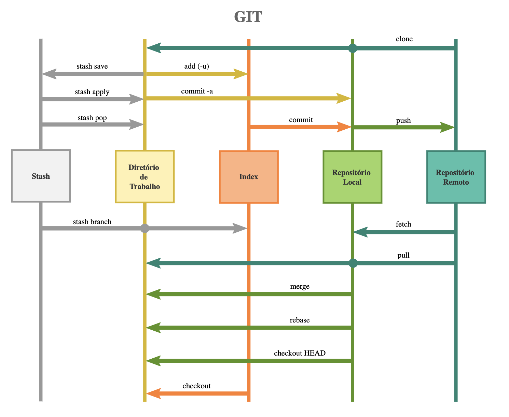

# GIT

## Arquitetura



## Principais Comandos

* Inicializando o repositório

```
git init
```

* Clonando o repositório

```
git clone usuário@servidor:/caminho/para/o/repositório
```

* Adicionando um arquivo (stage)

```
git add <arquivo>
git add *
```

* Comitando as alterações no repositório local

```
git commit -m "comentários das alterações"
```

* Enviando as alterações para o repositório remoto

```
git push origin master
```

* Para vincular o repositório local com um repositório remoto

```
git remote add origin <servidor>
```

* Criando um branch a partir do branch atual

```
git checkout -b funcionalidade_x
```

* Baixando um branch

```
git checkout master
```

* Apagando um branch

```
git branch -d funcionalidade_x
```

* Enviando o branch para o repositório remoto

```
git push origin <funcionalidade_x>
```

* Atualiza o repositório local buscando as alterações no repositório remoto

```
git pull
```

* Junta as alterações de um branch com o branch atual - merge

```
git merge <branch>
```

_Podem ocorrer conflitos caso a mesma linha de um arquivo tenha sido alterada no branch local e no branch do merge, Nesse caso é necessário resolver os conflitos, adicionar as alterações e comitar o merge._

```
git add <arquivo>
```

* Adicionando rótulo/label/tag para um commit

```
git tag 1.0.0 1b2e1d63ff
```
_1b2e1d63ff representa os 10 primeiros caracteres do id de commit o qual receberá o rótulo_

* Sobrescrever alterações locais

```
git checkout -- <arquivo>
```

_Nesse caso o comando vai sobrescrever as alterações locais, ou seja, tudo o que foi alterado será revertido para a versão mais recente do repositório remoto. Alterações já adicionadas ao índice/repositório local serão mantidas_

* Remover todas as alterações e commits locais

```
git fetch origin
git reset --hard origin/master
```
