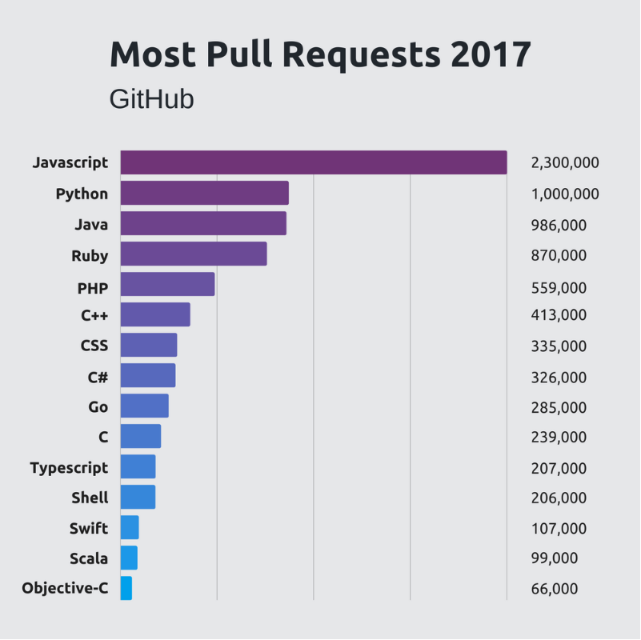
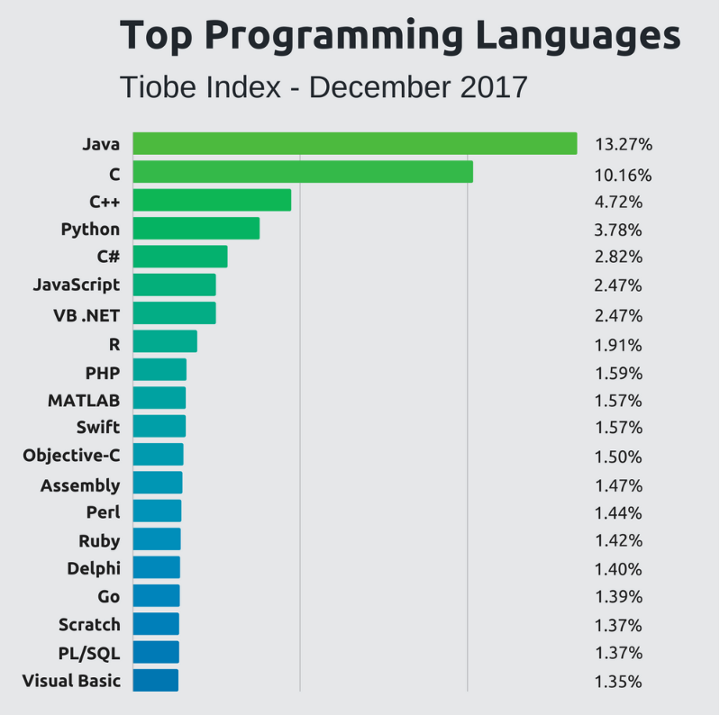

# Pesquisa

## A pesquisa deve incluir

* Breve histórico do JS até o ES6
* Diferenças principais entre ES5 e ES6
* Funcionalidades principais que o TypeScript adiciona ao ES6
* Exemplos de algorítimo cutilizando ES5, ES6 e TypeScript
* A pesquisa deve ser postada no Ambiente Virtual em formato PDF
* Deve constar o link para o repositório com os exemplo no PDF
* O repositório deve conter as instruções (README) para execução do código
* A pesquisa não deve conter mais que 5 páginas
* A utilização de qualquer fonte externa deve ser referenciada no final do documento (link, livro, ...)
  * A não utilização de referencia implica na invalidação do conteúdo do trabalho